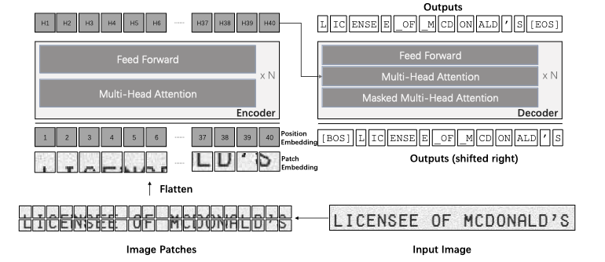
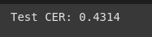
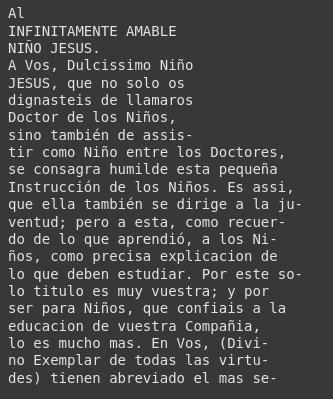
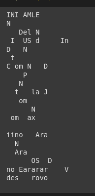

# **Submission for HumanAI RenAIssance Project Test**

Specific Test II. Optical Character Recognition done using transformers.

[Link to Colab notebook](https://colab.research.google.com/drive/1f493NXXo6pcOS057ef3FHbWK68RLm8GL?usp=sharing)

## **Description**

- Transformer Framework  
 
- I have used Word Dataset Sword6k for training and manually added some screenshots from the provided data.  [Link](https://figshare.com/articles/dataset/Word_Dataset_Sword6k_/21523479)
- I have `trocr-base-spanish` model architecture. [Link](https://huggingface.co/qantev/trocr-base-spanish)
- I have used word detector to segment words from the pdf file. [Link](https://github.com/githubharald/WordDetector)

## **Evaluation metrics**

- I have used CER to evaluate the model.
- Character Error Rate (CER) is an evaluatoin metric for OCR measuring character-level differences between OCR output and ground truth text. 
- CER is expressed as:
 $$
\text{CER} = \frac{\text{Insertions} + \text{Deletions} + \text{Substitutions}}{\text{Total characters in ground truth}} \times 100\%
$$

## **Results**

- I could only run 2 epochs because of limitations of colab free gpu time.
- Currently 2nd epoch returned `0.4314` CER.
- Running more epochs and providing more spanish words in training dataset will improve the results.
- 
- Here is the current prediction by the model for first page of first document.

  
  

<!-- - 
-  -->

## **Future Prospects**

- Currently, I have only added some screenshots from the provided spanish texts because the word segmentation model was not selecting the words properly and it was not possible to match image to word automatically. We can use CRAFT(The craft model was outdated and had some issue but if given time, I can implement it myself) for the same issue or some other line segmentation model(transformer model performs better for lines).
- I can do more preprocessing to the images from the pdf files to improve segmentation and ocr results.
- I can reduce loss by fine-tuning model parameters.

## **Folders/Files**

1. `human-ai.ipynb` - The main python notebook.
2. `train.zip` - ZIP file containing training images.
3. `img` - Folder containing cropped images from first PDF.
4. `humanai-task` - Folder contating files provided.